*Mise en place* (French pronunciation: [mi zɑ̃ ˈplas]) is a French culinary phrase which means "putting in place" or "gather". 
It refers to the setup required before cooking, and is often used in professional kitchens to refer to organizing and arranging the ingredients (e.g., cuts of meat, relishes, sauces, par-cooked items, spices, freshly chopped vegetables, and other components) that a cook will require for the menu items that are expected to be prepared during a shift.[^1]

[^1]: Source: [Wikipedia](https://en.wikipedia.org/wiki/Mise_en_place).

{fig-align="center" fig-alt="A photo of a kitchen counter with various ingredients and tools arranged neatly, ready for cooking."}

This lab is all about setting up your computing environment for the course and putting in place all the bits and bobbles you'll need for the rest of the semester.

And just like the *mise an place* phase for cooking something that is new to you, it might not be entirely clear how everything will come together at the end.
Hang in there, and it'll all start to make sense soon!

# `Hello, World!`

## Computational toolkit

You may have heard/seen this phrase, `Hello, World!`, elsewhere before.
It's usually the first thing you learn in programming -- to learn to write a computer program to print this sentence to the screen.
Things will be different in this course, as it's not a programming course, but a data science course.
In this course, you'll learn to use a computing language (called R) to work with data.

But first, we need to set you up for success!
Let's briefly review the components of the computational toolkit for the course:

1.  R: The programming language you'll learn in this course.

2.  RStudio: The piece of software (a.k.a. the integrated development environment, IDE) you'll use to write R code in.

    ::: callout-note
    R is the name of the programming language itself and RStudio is a convenient interface.
    :::

3.  Quarto: The tool you'll use to create reproducible computational documents that contain both your narrative (i.e., words in English) and your code (i.e., code in R). Every piece of assignment you hand in will be a Quarto document.

    ::: callout-note
    You might be familiar with word processors like MS Word or Google Docs.
    We will not be using these in this class.
    Instead, the words you would write in such a document as well as the code will go into a Quarto document, and when you *render* the document you will get a document out that has your words, your code, and the output of that code.
    Everything in one place, beautifully formatted!
    :::

4.  Posit Cloud: the cloud platform (in other words, website) that we'll use to access RStudio.

5.  Git: Version control system.

6.  GitHub: A web hosting service for the Git version control system that also allows for transparent collaboration between team members.

    ::: callout-note
    Git is a version control system (like "Track Changes" features from Microsoft Word but more powerful) and GitHub is the home for your Git-based projects on the internet (like DropBox but much better).
    :::

## An analogy to English

While most of the above tools might be new to you, they have many similarities with tools you have probably seen before.

Suppose you wanted to write an essay for a literature class.
You would need to pick a language (e.g. English) and choose an interface to write your document with (such as Microsoft word with a .docx word doc).
You also might want to use track changes to see edits you make and use a platform such as Google Drive to collaborate.
\
\
While the computational toolkit is different than the one for a literature class, we can find many similarities between the tools, as is shown in the figure below.

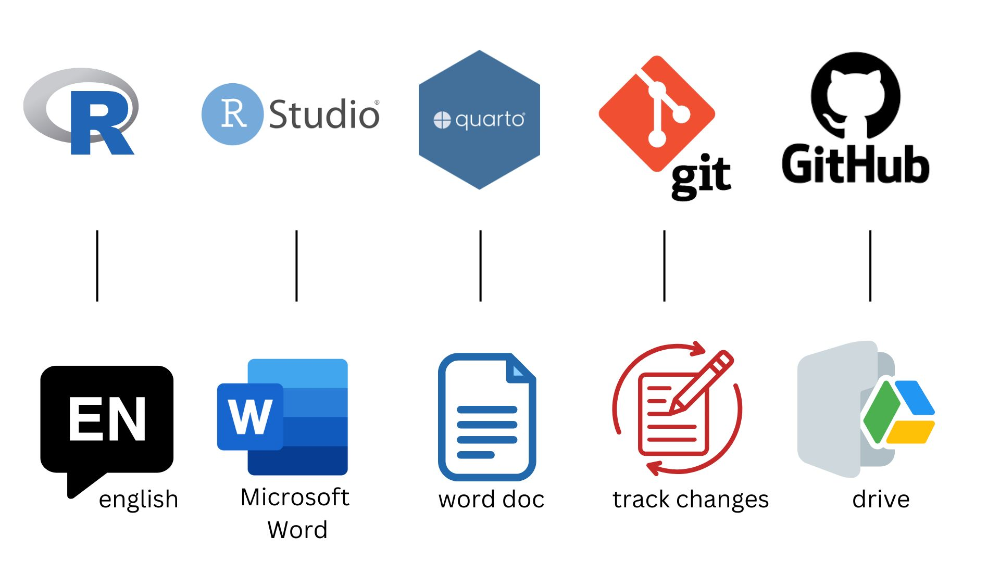{fig-align="center" width="624" height="327"}

# Set up GitHub

## Create a GitHub account

Go to <https://github.com/> and walk through the steps for creating an account.
You do not have to use your Ramapo email address, but I recommend doing so.[^3]

[^3]: GitHub has some perks for students you can take advantage of later in the course or in your future work, and it helps to have a .edu address to get verified as a student.

Tips for choosing a username:[^4]

[^4]: Source: [Happy git with R](https://happygitwithr.com/github-acct#username-advice) by Jenny Bryan

- Incorporate your actual name.
- Reuse username from other contexts, e.g., X or Discord.
- Pick a username you'll be comfortable revealing to your future boss.
- Shorter is better than longer.
- All lower case is recommended.
- Be as unique as possible in as few characters as possible.
- Make it timeless. Don’t highlight your current university, employer, etc.
- Avoid words laden with special meaning in programming, like `NA`.

::: {.callout-important collapse="true"}
## What if I already have a GitHub account?

If you already have a GitHub account, you do not need to create a new one for this course.
Just log in to that account to make sure you still remember your username and password.
:::

## Configure two-factor authentication (2FA)

You will need to enable 2FA in your GitHub account. The best way is through a time-based one-time password (TOTP) application, such as Google Authenticator or Microsoft Authenticator. Alternatively, you can set up 2FA using SMS (text) messages.

Follow the [linked instructions](https://docs.github.com/en/authentication/securing-your-account-with-two-factor-authentication-2fa/configuring-two-factor-authentication#configuring-two-factor-authentication-using-a-totp-app) for configuring 2FA.

## Update your GitHub profile

[This step can be done later.]

Once you have created your GitHub account, you can update your profile if you wish to.

To do so, click on your profile icon in the upper right corner of the GitHub page and select *Settings*.
Then, on the left side of the page, click on *Public profile* and fill out your profile information.

Once done, click *Update profile* near the middle of the page.

::: {.callout-warning collapse="true"}
## Add a profile picture

This is not required, but is recommended.
It will help us get to know you (and recognize you in class) and will also help you get to know your classmates.
:::

# Access R and RStudio

## Join our Posit Cloud space

- Join our Posit Cloud course "space" by clicking the "Join Posit Cloud course space" link posted in **Canvas**.
- Either click 'Log in with GitHub' and log in with your GitHub credentials, or click 'Sign Up' and create a new account using your Ramapo email address. (Either is fine.)
- Join the course space, **data-101-fall-2026**.


## Enable private repo access

- Go to Posit Cloud (if you're not there already)
- Click on your name on the top right corner to open the menu.
- Then, click on Authentication.

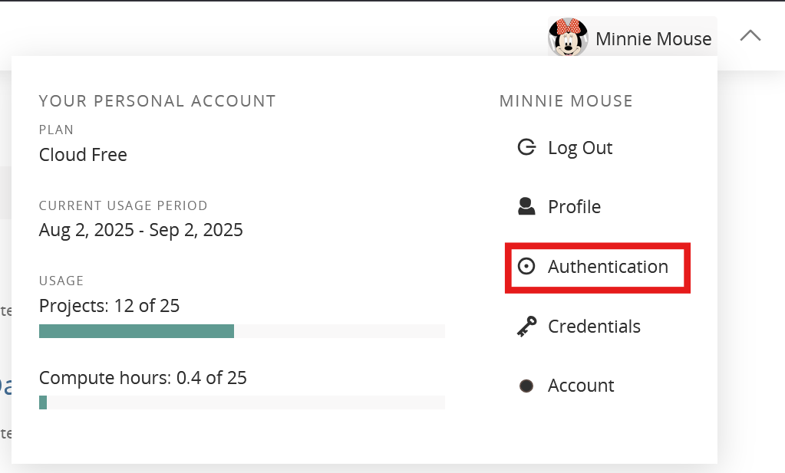{fig-align="center"}


- In the Authentication menu, under GitHub, check the box for **Enabled**. This will launch a browser window where you'll be prompted in GitHub to authorize. Click the green **Authorize posit-hosted** button.

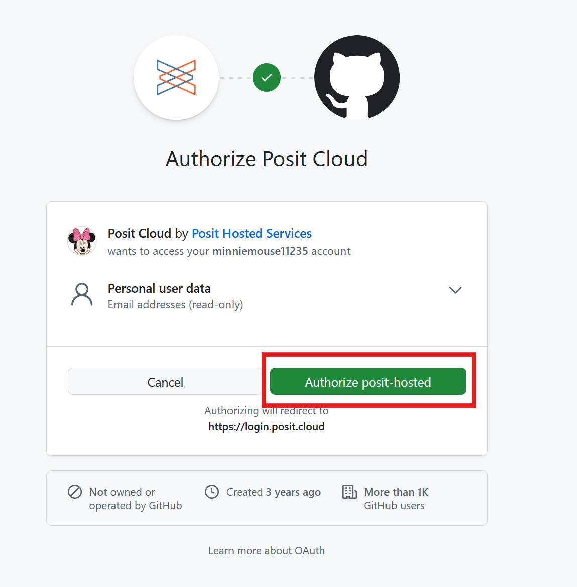{fig-align="center"}

- This brings you back to the Posit Cloud Authentication menu. Next to GitHub, the **Enabled** box should already be checked off. Check off the **Private repo access also enabled (for Posit Cloud and shinyapps.io only)** box.

- You'll be brought back to GitHub and asked a second time to authorize posit-hosted. Click the green **Authorize posit-hosted** button.

- Once you're done, both of these boxes should be checked:

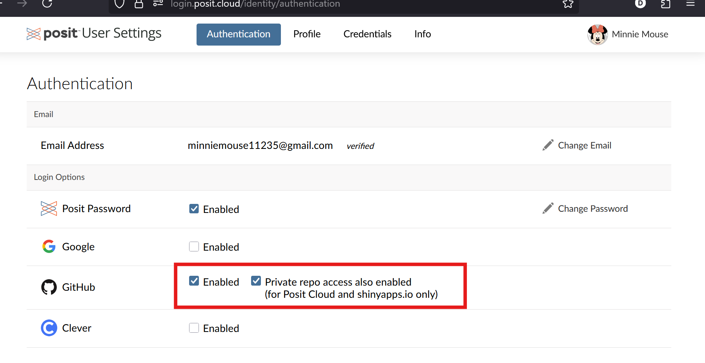{fig-align="center"}


Then you can close the Authentication window in Posit Cloud and go back to the main Posit Cloud page.

You won't need to repeat the above steps - they are just one-time setup.

Before going on to the next step, in Posit Cloud you must **go to our course space data-101-fall-2026**.

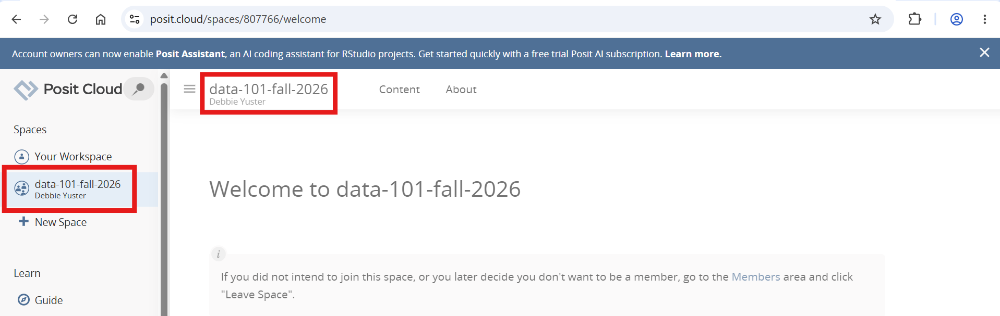{fig-align="center"}


It's very important that you do your coursework in our course space (**data-101-fall-2026**, NOT "Your Workspace"). The reasons are:

-   It's only when you're in the course space that you'll be able to benefit from R packages I've pre-installed for you so that your project can be configured correctly.
-   It's only when you're in the course space that your usage of Posit Cloud won't count towards the free usage limits in your personal workspace.

You can confirm that you are in the course space by checking out what's on your top bar in Posit Cloud. It should say **data-101-fall-2026**.

## Clone your first repository

Now that you have your GitHub account set up and linked, you can clone your first repository. Cloning a repository is like downloading it onto your computer (or in this case, into your Posit Cloud account).

To do so, follow these steps.

-   Go to the repository for **lab-0** in the course GitHub organization: <https://github.com/rcnj-ids-fa26/lab-0>.

-   Click on the green **CODE** button, select **HTTPS** (this might already be selected by default).
    Click on the clipboard icon to copy the repo URL.

    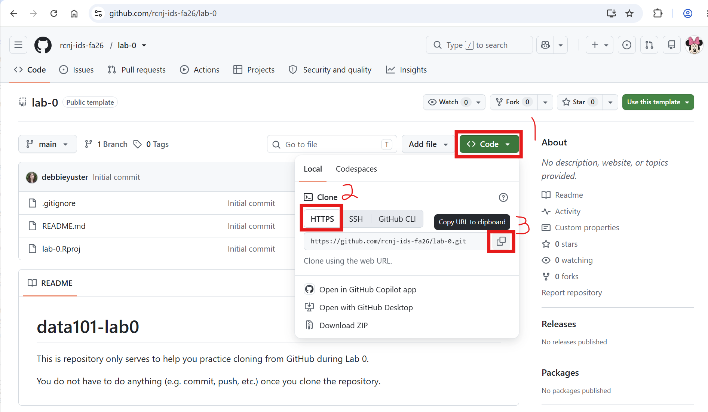{fig-alt="Clone with HTTPS button in GitHub repository page." width="600" fig-align="center"}

-   In Posit Cloud (check again you are in the data-101-fall-2026 workspace, not Your Workspace), click *New Project* ➛ *New Project from Git Repository*.

    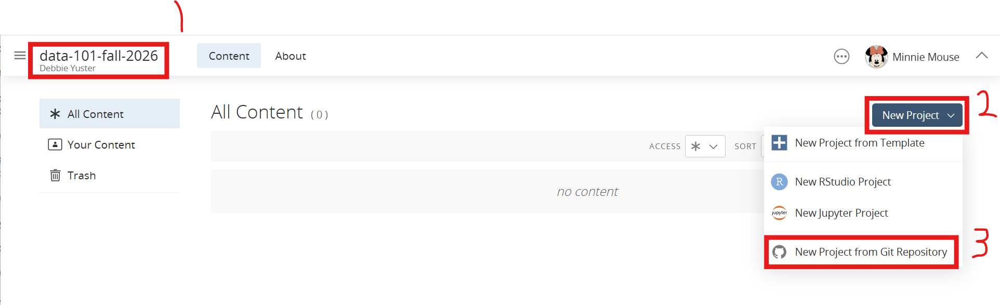{fig-alt="Creating a new project in Posit Cloud." width="600" fig-align="center"}

-   Copy and paste the URL of your assignment repo into the dialog box *URL of your Git Repository*.

-   Click *OK*.

    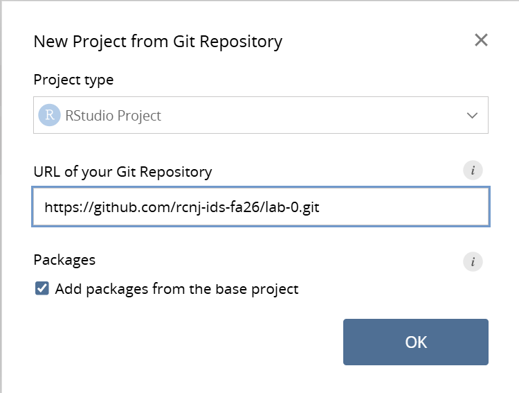{fig-alt="Cloning a GitHub repository in RStudio." width="600" fig-align="center"}

-   RStudio will now clone the repo and create a new RStudio project for you.
    This might take a few seconds.
    Once done, the files from your GitHub repo will be displayed in the *Files* pane in RStudio.
    
::: callout-note
We might sometimes use "Posit Cloud" and "RStudio" interchangeably. Posit Cloud is the cloud platform we will use in this course. Posit Cloud allows you to create projects using RStudio as well as other options like Jupyter (which we won't use). RStudio is an Integrated Development Environment (IDE) for the R programming language. It sounds quite confusing, but you'll get the hang of it!
:::

## Set up your Personal Access Token (PAT)


You will authenticate GitHub using a PAT (Personal Access Token -- an alternative to passwords).

Below is an outline of the authentication steps.

::: callout-note
You only need to do this authentication process one time on a single system.
:::

-   Go into the **Console** of your RStudio project and copy-and-paste or type the following in the Console.

```{r}
usethis::create_github_token()
```


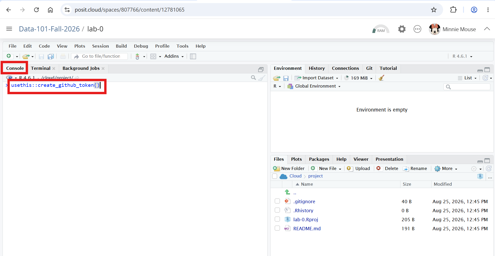{fig-align="center"}


- You will be brought to GitHub and may be asked to authenticate.
- In the Note, replace the default text DESCRIBE THE TOKEN'S USE CASE with the text DATA 101 (or similar)
- Set the Expiration to a Custom date: 12/31/2026
- Leave all the checkboxes set to the defaults
- Scroll down and click the green **Generate token** button

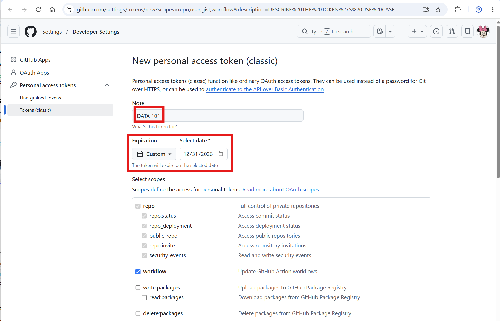{fig-align="center"}

- **Copy the token** (long string of random-looking characters) that gets generated. Store this somewhere secure where you can access it, as you'll need it in the future.

::: callout-warning
**Be sure you store this token for future use, or you'll have to repeat the above steps!**
:::


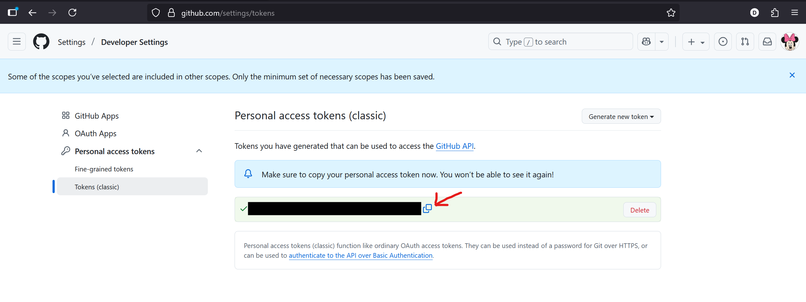{fig-align="center"}

- Go back into RStudio, and **type** (don't copy, or you'll overwrite the token you copied from GitHub) the following into the console:

```{r}
gitcreds::gitcreds_set()
```

- At the prompt ("Enter password or token:"), paste the token you copied from GitHub

- RStudio will register and store your Github credentials (PAT)

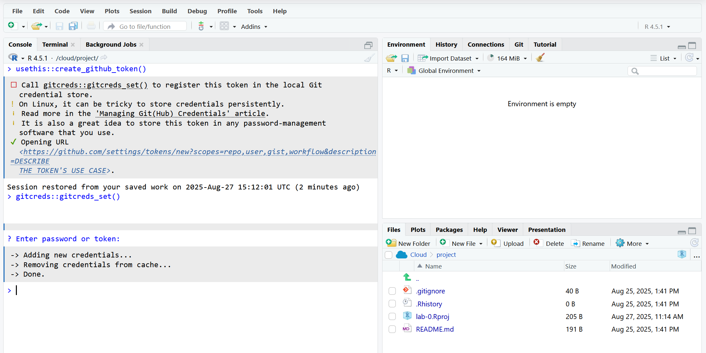{fig-align="center"}


## Configure Git to introduce yourself

There is one more thing we need to do.
Specifically, we need to configure your git so that RStudio can communicate with GitHub.
This requires two pieces of information: your name and email address.

To do so, you will use the `use_git_config()` function from the `usethis` package.

::: callout-note
You'll hear about 📦 packages a lot in the context of R -- basically they're how developers write functions and bundle them to distribute to the community (and more on this later too!).
:::

Type the following lines of code in the **console** in RStudio filling in your name and the address associated with your GitHub account.

```{r}
usethis::use_git_config(
  user.name = "Your name", 
  user.email = "Email associated with your GitHub account",
)
```

For example, student Minnie Mouse would type

```{r}
usethis::use_git_config(
  user.name = "Minnie Mouse", 
  user.email = "mmouse1@ramapo.edu"
)
```

::: callout-note
Use the email address you used to create your GitHub account, even if it isn't your Ramapo email.
:::

## Check that everything's working

In the console, copy-paste or type:

```{r}
usethis::git_sitrep()
```

If all goes well:

- the first section, "Git global (user)" should list your name and email

- the second section, "GitHub user" should say `<discovered>` after "Personal access token for https://github.com:". If it instead says `<unset>`, something's wrong.

- You can ignore the rest of the output, but if you think something's wrong, ask about it

You are now ready interact with GitHub via RStudio!


# Hello DATA 101!

Last but not least, fill out the course "Getting to know you" survey in Canvas.

We will use the information collected in this survey for a variety of goals, from inviting you to the course GitHub organization (and you should accept that invite soon as you see it in your mailbox!) to getting to know you as a person and your course goals and concerns.
