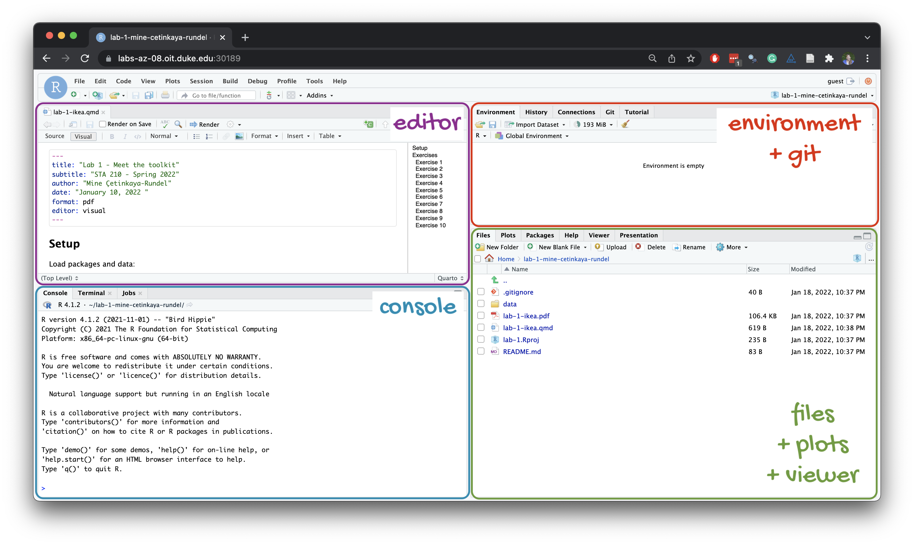
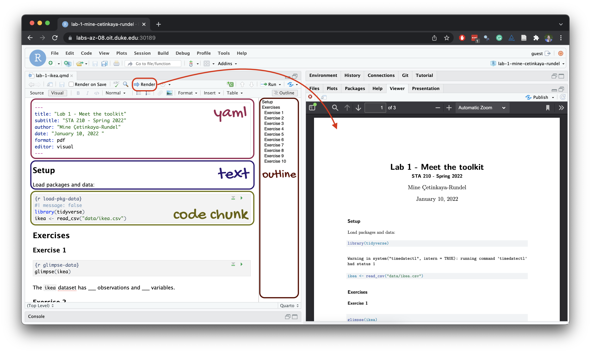

## Learning objectives

By the end of the lab, you will...

-   Be familiar with the workflow using R, RStudio, Git, and GitHub
-   Gain practice writing a reproducible report using Quarto
-   Practice version control using Git and GitHub
-   Be able to create data visualizations using `ggplot2`

## Getting started

### Step 1: Login to Posit Cloud

-   Go to <https://posit.cloud> and go to our course workspace.

#### Refresher: R and R Studio

Below are the components of the RStudio IDE.

{fig-alt="RStudio IDE"}

Below are the components of a Quarto (.qmd) file.

{fig-alt="Quarto document"}

### Step 2: Clone the repo & start new RStudio project

-   Go to the [GitHub course organization](https://github.com/rcnj-ids-fa26) and click on the repo with the prefix **lab-1**.
    It contains the starter documents you need to complete the lab.

-   Click on the green **CODE** button and select **HTTPS** (it should already be selected by default).
    Click on the clipboard icon to copy the repo URL.

-   In RStudio, go to New Project ➛ New Project from Git Repository ➛ Git
-   Paste the URL of your assignment repo into the dialog box URL of your Git Repository.
-   Click OK. The repo will be cloned and an RStudio project will be created.
-   Go to the Files pane and click **lab-1.qmd** to open the template Quarto file.
    This is where you will write up your code and narrative for the lab.

::: callout-important
Your repo also contains a `data/` folder and a `tests/` folder.
**Do not move, rename, edit, or delete them.**
The template reads data from `data/` and uses `tests/` to give you instant feedback on your answers (see "Checking your work" below).
:::

### Step 3: Update the YAML

The top portion of your Quarto file (between the three dashed lines) is called **YAML**.
It is a human-friendly data representation for all programming languages.
All you need to know is that this area is called the YAML (we will refer to it as such) and that it contains meta information about your document.

-   Open the Quarto (`.qmd`) file in your project, change the author name to your name, and render the document.

-   Examine the rendered document and make sure your name is updated in the document.

### Step 4: Commit your changes

-   Go to the Git pane in RStudio.
    This will be in the top right hand corner in a separate tab.

    If you have made changes to your Quarto (.qmd) file, you should see it listed here.
    If you have rendered the document, you should also see its output, a PDF file, listed there.

-   If you're happy with the file changes you've made, prepare the changes to be pushed to your remote repository.

    -   First, **stage** your changes by checking the appropriate box on the files you want to prepare.

    -   Next, write a meaningful commit message (for instance, "Updated author name") in the **Commit message** box.

    -   Finally, click **Commit**.
        Note that every commit needs to have a commit message associated with it.

::: callout-tip
## A good workflow

You do not need to commit after every small edit.
Commit meaningful states of your work: for example, after completing a question or after making a plot you are happy with.
You should have at least three meaningful commits by the end of this lab.
:::

### Step 5: Pushing changes

Now that you have made an update and committed this change, it's time to push these changes to your repo on GitHub.

-   In the Git pane, click on Push.

-   Then, make sure all the changes went to GitHub.
    Go to your GitHub repo in your browser and refresh the page.
    You should see your commit message next to the updated files.
    If you see this, all your changes are on GitHub, and you're good to go!

::: callout-warning
If you don't see your update, go back to Step 4.
Remember that in order to push your changes to GitHub, you must have **staged** (checked boxes) your **commit** (with a commit message) to be pushed and then click on **Push**.
:::

## Packages

In this lab we will work with the **tidyverse** package, which is a collection of packages for doing data analysis in a "tidy" way.

```{r}
#| eval: true
#| message: false
library(tidyverse)
```

-   **Run** the code cell by clicking on the green triangle (play) button. This loads the package to make its features (the functions and datasets in it) be accessible from your *Console*.
-   Then, **render** the document which loads this package to make its features (the functions and datasets in it) be available for other code cells in your Quarto document.

## Checking your work

This lab is partially **autograded**.
That changes two things about how you work:

1.  **Answers go into named objects.**
    Each question below tells you exactly what to name your answer (e.g., "save your histogram as `hist_100`"), and the template's code cells already contain placeholders such as `hist_100 <- NULL` with a short comment describing what goes there.
    Replace the `NULL` (or `NA`) with your code, but **do not change the object names**.
    The autograder looks for these exact names; an answer stored under a different name receives no credit, even if the code is correct.

2.  **You can check your answers as you go.**
    After each question, the template contains a check chunk that runs `ottr::check()` on that question.
    Run it to see the results of the **public checks**: quick tests that confirm your answer has the right structure (correct type of plot, right variables on the right axes, and so on).
    These checks are designed to tell you whether you're on the right track *without* revealing the answer.

::: callout-note
## Multiple choice and short answers

Some questions ask you to record an answer by assigning a value to a variable.
Letters and names must be typed as strings (in quotes), for example `q7_guess <- "B"` or `q2_outlier <- "LAKE"`.
County names should be spelled as they appear in the data; capitalization does not matter.
Numeric answers, such as a binwidth, are typed as numbers without quotes, for example `q1_best <- 100`.
:::

::: callout-warning
Passing all public checks does **not** guarantee full credit.
When your submission is graded, additional **hidden tests** check your answers for full correctness.
The public checks also confirm that each plot has a title and that axis and legend labels have been set to something more readable than the raw variable names; your code style and workflow are reviewed from your PDF.
A check chunk that errors with something like "object not found" usually means you haven't run the cells above it -- run all chunks in order (or render the document) and try again.
:::

## Guidelines

As we've discussed in lecture, your plots should include an informative title, axes and legends should have human-readable labels, and careful consideration should be given to aesthetic choices.

Additionally, code should follow the [tidyverse style](https://style.tidyverse.org/).
Particularly,

-   there should be spaces before and line breaks after each `+` when building a `ggplot`,

-   there should also be spaces before and line breaks after each `|>` in a data transformation pipeline,

-   code should be properly indented,

-   there should be spaces around `=` signs and spaces after commas.

Furthermore, all code should be visible in the PDF output, i.e., should not run off the page on the PDF.
Long lines that run off the page should be split across multiple lines with line breaks.[^1]

[^1]: Remember, haikus not novellas when writing code!

Remember that continuing to develop a sound workflow for reproducible data analysis is important as you complete the lab and other assignments in this course.
There will be periodic reminders in this assignment to remind you to **render, commit, and push** your changes to GitHub.

::: callout-important
You should have at least 3 commits with meaningful commit messages by the end of the assignment.
:::

# Questions

## Part 1

**Let's take a trip to the Midwest!**

We will use the `midwest` data frame for this lab.
It is part of the **ggplot2** R package, so the `midwest` data set is automatically loaded when you load the tidyverse package.

The data contains demographic characteristics of counties in the Midwest region of the United States.

Because the data set is part of the **ggplot2** package, you can read documentation for the data set, including variable definitions by typing `?midwest` in the Console or searching for `midwest` in the Help pane.

### Question 1

Visualize the distribution of population density of counties using a histogram with `geom_histogram()` with four separate binwidths: a binwidth of 100, a binwidth of 1,000, a binwidth of 10,000, and a binwidth of 100,000.
Save the four plots as `hist_100`, `hist_1000`, `hist_10000`, and `hist_100000`.
For example, you can create the first plot with:

```{r}
hist_100 <- ggplot(midwest, aes(x = popdensity)) +
  geom_histogram(binwidth = 100) +
  labs(
    x = "Population density",
    y = "Count",
    title = "Population density of Midwestern counties",
    subtitle = "Binwidth = 100"
  )
hist_100
```

Note that the plot is first *saved* to a named object and then *printed* by writing its name on its own line, so that it appears in your rendered document.

You will need to make four different histograms.
Make sure to set informative titles and axis labels for each of your plots.
Then, record the binwidth you find most appropriate for these data in `q1_best` (as a number: `100`, `1000`, `10000`, or `100000`).

::: {.callout-tip title="Render, commit, and push"}
Render, commit, and push your changes to GitHub with the commit message "Added answer for Question 1".

Make sure to commit and push all changed files so that your Git pane is empty afterward.
:::

### Question 2

Visualize the distribution of population density of counties again, this time using a boxplot with `geom_boxplot()`, saved as `box_density`.
Make sure to set informative titles and axis labels for your plot.

Then, using your box plot, **estimate by eye** the center and spread of the distribution of population density and record your estimates as numbers:

-   `q2_median`: the median population density (the center of the distribution).
-   `q2_1st_quartile` and `q2_3rd_quartile`: the first and third quartiles, i.e., the values between which the middle 50% of counties fall (the spread of the distribution).

You are not expected to compute these values, and precision is not the point; an estimate in the right ballpark earns full credit.

::: callout-tip
A few counties have enormous population densities, which stretches the x-axis of your boxplot so far that the box itself is squeezed into a narrow sliver at the far left.
Look closely at where the box and its center line fall relative to the axis tick marks.
:::

Next, identify at least one county that is a clear outlier by name and record it in `q2_outlier`.
You can use the data viewer to identify the outliers interactively, you do not have to write code to identify them.
(To do this, go to the Console, load the `tidyverse` package, then `View` the `midwest` data frame by running the code `View(midwest)` in the Console.
This will cause the **interactive data viewer** tab to open in the upper left pane of RStudio, where you can sort the data by clicking on a column name.)

Finally, record in `q2_why` the best explanation for why it makes sense that this county is an outlier.
You may need to look up the county (for example, with a quick web search) to learn what is there.

   A. It contains a major city (such as Chicago, Milwaukee, or Detroit), so a very large population lives on a modest land area.

   B. It is the largest county by land area in the Midwest.

   C. Its population density is most likely a data entry error.

   D. It has the highest percentage of college graduates in the Midwest.

::: {.callout-tip title="Render, commit, and push"}
Render, commit, and push your changes to GitHub with the commit message "Added answer for Question 2".

Make sure to commit and push all changed files so that your Git pane is empty afterward.
:::

### Question 3

Create a scatterplot of the percentage below poverty (`percbelowpoverty` on the y-axis) versus percentage of people with a college degree (`percollege` on the x-axis), where the color [**and**]{.underline} shape of points are determined by `state`.
Save the plot as `scatter_state`.
Make sure to set informative titles, axis, and legend labels for your plot.

A relationship between two numerical variables is called **positive** if larger values of one variable tend to go with larger values of the other, so that the points trend upward from left to right.
It is called **negative** if larger values of one variable tend to go with smaller values of the other, so that the points trend downward from left to right.

First, record in `q3_relationship` the option that best describes the overall relationship between percentage of people with a college degree and percentage below poverty in Midwestern counties:

   A. Positive: counties with a higher percentage of college graduates tend to have a higher percentage of residents below the poverty line.

   B. Negative: counties with a higher percentage of college graduates tend to have a lower percentage of residents below the poverty line.

   C. There is no relationship between the two variables.

Then, identify at least one county that is a clear outlier by name and record it in `q3_outlier`, and record the two-letter abbreviation of the state it is in (as it appears in the data, e.g., `"OH"`) in `q3_outlier_state`.
You can use the data viewer to identify the outliers interactively, you do not have to write code to identify them.

::: {.callout-tip title="Render, commit, and push"}
Render, commit, and push your changes to GitHub with the commit message "Added answer for Question 3".

Make sure to commit and push all changed files so that your Git pane is empty afterward.
:::

### Question 4

*Do some states have counties that tend to be geographically larger than others?*

To explore this question, create side-by-side boxplots of area (`area`) of a county based on state (`state`), saved as `box_area`.
Make sure to set informative titles and axis labels for your plot.

Then, based on your plot, record the two-letter abbreviation (e.g., `"OH"`) of:

-   `q4_largest_typical`: the state whose counties have the largest typical (median) area.
-   `q4_smallest_typical`: the state whose counties have the smallest typical (median) area.
-   `q4_most_variable`: the state with the most variability in county area, i.e., the widest spread of values.

Finally, find the state with the single largest county, then identify that county by name and record it in `q4_largest`.
You can use the data viewer to identify it interactively, you do not have to write code.

::: {.callout-tip title="Render, commit, and push"}
Now is another good time to render, commit, and push your changes to GitHub with a meaningful commit message.

Once again, make sure to commit and push all changed files so that your Git pane is empty afterwards.
:::

### Question 5

*Do some states have a higher percentage of their counties located in a metropolitan area?*

Create a standardized (filled) bar chart with one bar per state and the bar filled with colors according to the value of `metro` – one color indicating `Yes` and the other color indicating `No` for whether a county is considered to be a metro area.
The y-axis of the stacked bar chart should range from 0 to 1, indicating proportions.
Save the plot as `bar_metro`, and make sure to set informative titles, axis, and legend labels.

Then, based on your plot, record:

-   `q5_highest_state`: the two-letter abbreviation of the state with the highest proportion of counties in metro areas.
-   `q5_lowest_state`: the two-letter abbreviation of the state with the lowest proportion of counties in metro areas.
-   `q5_prop_OH`: your estimate, read off the plot, of the proportion of Ohio counties that are in metro areas, as a number between 0 and 1 (e.g., `0.35`).

::: callout-tip
## Hint

For this question, your template begins with the data wrangling pipeline below.
We will learn more about data wrangling in the coming weeks, so this is a mini-preview.
This pipeline creates a new variable called `metro` based on the value of the existing variable called `inmetro`.
If the value of `inmetro` is equal to 1 (`inmetro == 1`), it sets the value of `metro` to `"Yes"`, and if not, it sets the value of `metro` to `"No"`.
The resulting data frame is assigned back to `midwest`, overwriting the existing `midwest` data frame with a version that includes the new `metro` variable.
Make sure to run it before building your plot.

```{r}
#| label: hint
#| eval: false
midwest <- midwest |>
  mutate(metro = if_else(inmetro == 1, "Yes", "No"))
```
:::

::: {.callout-tip title="Render, commit, and push"}
Now is another good time to render, commit, and push your changes to GitHub with a meaningful commit message.
:::

### Question 6

Below is a scatterplot of the percentage below poverty versus percentage of people with a college degree, where each county is colored according to the percentage of residents who are white,  "faceted" by state.
Examine the plot.

```{r}
#| echo: false
#| eval: true
ggplot(
  midwest,
  aes(x = percollege, y = percbelowpoverty, color = percwhite)
) +
  geom_point(size = 2, alpha = 0.5) +
  facet_wrap(~state) +
  theme_minimal() +
  labs(
    title = "College education, poverty, and race in Midwestern counties",
    x = "% college educated",
    y = "% below poverty line",
    color = "% white"
  )
```

Identify the county that is a clear outlier in Wisconsin (WI) by name and record it in `q6_outlier`.
You can use the data viewer to identify it interactively, you do not have to write code.

Then, investigate the population composition of this county in the data viewer by looking at the percentage of residents of different races living there (the variables `percwhite`, `percblack`, `percamerindan`, `percasian`, and `percother`).
Record the county's percentage of white residents (`percwhite`) in `q6_pct_white`, as a number between 0 and 100.
Finally, record in `q6_majority` the racial group that makes up the majority of the county's residents:

   A. White

   B. Black

   C. American Indian

   D. Asian

::: {.callout-tip title="Render, commit, and push"}
Render, commit, and push your changes to GitHub with a meaningful commit message.

Make sure to commit and push all changed files so that your Git pane is empty afterwards.
:::

## Part 2

**Enough about the Midwest!**

In this part we will use a more recent dataset on counties in North Carolina.

This dataset is stored in a file called `nc-county.csv` in the `data` folder of your project/repository.
Your template reads this file into R with the following code:

```{r}
#| eval: false
nc_county <- read_csv("data/nc-county.csv")
```

This will read the CSV (comma separated values) file from the `data` folder and store the dataset as a data frame called `nc_county` in R.

The variables in the dataset and their descriptions are as follows:

-   `county`: Name of county.
-   `state_abb`: State abbreviation (NC).
-   `state_name`: State name (North Carolina).
-   `land_area_m2`: Land area of county in meters-squared, based on the 2020 census.
-   `land_area_mi2`: Land area of county in miles-squared, based on the 2020 census.
-   `population`: Population of county, based on the 2020 census.
-   `density`: Population density calculated as population divided by land area in miles-squared.

In addition to being more recent, this dataset is also more complete in the sense that we know the units of population density: people per mile-squared!

### Question 7

First, guess what the relationship between population density and land area might be, and record your guess in `q7_guess`:

   A. positive

   B. negative

   C. no relationship

(Any guess earns credit -- you are recording a prediction, not an answer.)

Then, make a scatter plot of population density (`density` on the y-axis) vs. land area in miles-squared (`land_area_mi2` on the x-axis), saved as `scatter_mi2`.
Make sure to set an informative title and axis labels for your plot.

Then, record in `q7_relationship` the option that best describes the relationship you see:

   A. Positive: counties with larger land areas tend to have higher population densities.

   B. Negative: counties with larger land areas tend to have lower population densities.

   C. No clear relationship: most counties have low population density regardless of their size, and the few very dense counties are not the largest ones.

Compare your answer to your guess in `q7_guess` -- was your guess correct?

### Question 8

Now make a scatter plot of population density (`density` on the y-axis) vs. land area in meters-squared (`land_area_m2` on the x-axis), saved as `scatter_m2`.
Make sure to set an informative title and axis labels for your plot.

Compare this scatterplot to the one in Question 7 and record your answer in `q8_compare`:

   A. The relationship looks completely different, because meters-squared measures a different aspect of land than miles-squared.

   B. The pattern of points is identical; only the scale of the x-axis changes, because land area in meters-squared is a constant multiple of land area in miles-squared.

   C. The relationship reverses direction, because the unit conversion flips the ordering of the counties.

   D. The plot shows fewer points, because some counties do not have a land area in meters-squared.

::: {.callout-tip title="Render, commit, and push"}
Render, commit, and push your final changes to GitHub with a meaningful commit message.

Make sure to commit and push all changed files so that your Git pane is empty afterwards.
:::

### Question 9

Make sure to select your pages on Gradescope!
You don't need to write an answer for this question, if you select your pages when you upload your lab PDF to Gradescope, you'll get full points on this question.
Otherwise, you'll get a 0 on this question.[^2]

[^2]: We're assigning points to this seemingly trivial task because not selecting your pages and questions will greatly slow down the grading.
    So we want to make sure you're properly motivated to complete this task!

# Wrap-up

## Submission

::: callout-warning
Before you wrap up the assignment, make sure all of your files are updated in your GitHub repo.
We will be checking these to make sure you have been committing and pushing changes (with descriptive commit messages).

You must turn in **both** the `.qmd` file and the PDF to Gradescope by the submission deadline to be considered "on time".
:::

Download your completed `lab-1.qmd` and `lab-1.pdf` files. To download a file from Posit Cloud, go to the **Files** pane, select the file by marking its **checkbox**, click **More**, then **Export**.

This lab requires **two assignment submissions** on Gradescope (accessed via Canvas), both due by the deadline:

1.  **Lab 1 QMD:** upload your completed **`lab-1.qmd`** file.
    The autograder will run the same public checks you saw while working, and you will see those results right away.
    The hidden correctness tests are also run, but their results will be released only after the lab has been graded.

2.  **Lab 1 PDF:** upload your rendered PDF document **`lab-1.pdf`**.
    This is where you **select pages** (as mentioned above in Question 9).
    Note that a single question may have multiple pages associated with it, and a single page may be associated with multiple questions.
    Mark all the pages associated with each question -- see [this article](https://guides.gradescope.com/hc/en-us/articles/21864315441677-Submitting-a-PDF-for-an-assignment) for instructions. All the pages of your lab should be associated with at least one question (i.e., should be "checked").

::: callout-important
## Checklist

Make sure you have:

-   answered all questions, using the exact object names given in each question
-   run the check chunk for each question and reviewed the results
-   rendered your Quarto document
-   committed and pushed everything to your GitHub repository so that the Git pane in RStudio is empty
-   downloaded your `.qmd` and PDF from RStudio onto your computer
-   uploaded your `lab-1.qmd` file to the Lab 1 QMD Gradescope assignment and confirmed the autograder ran
-   uploaded your PDF file `lab-1.pdf` to the Lab 1 PDF Gradescope assignment and selected the pages associated with each question
:::
