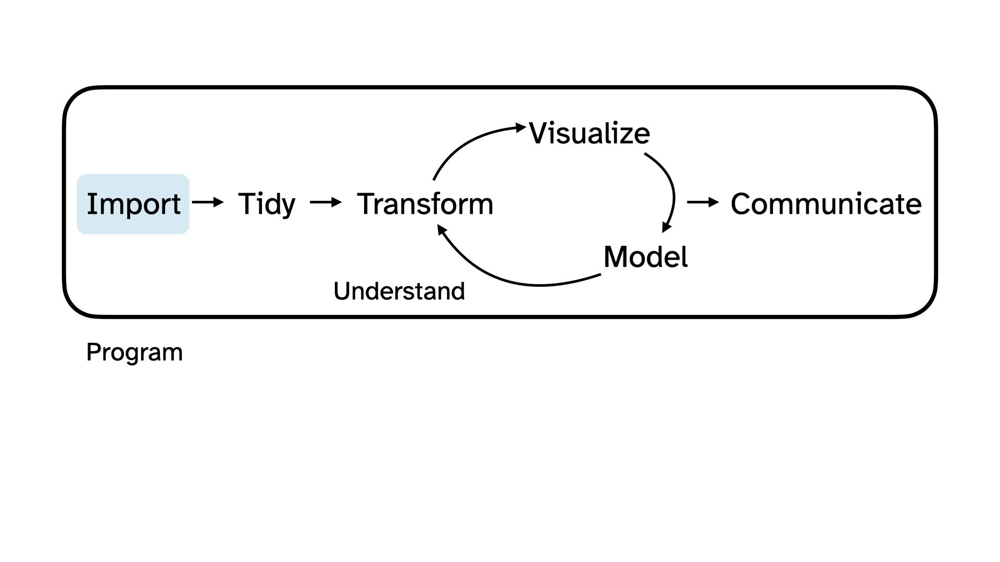
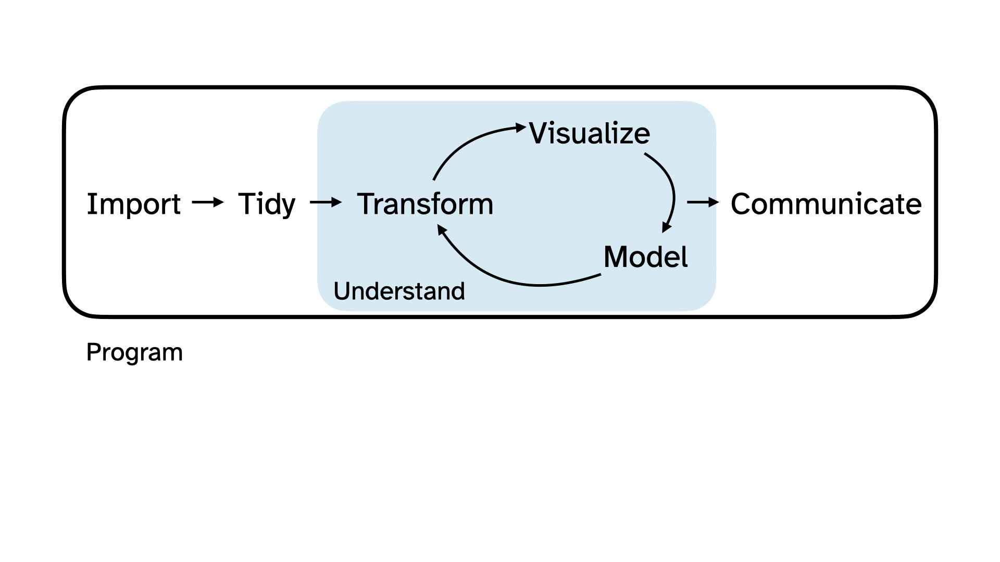
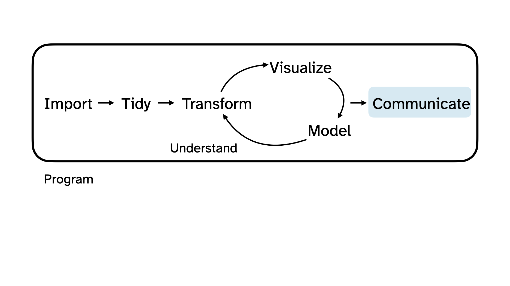
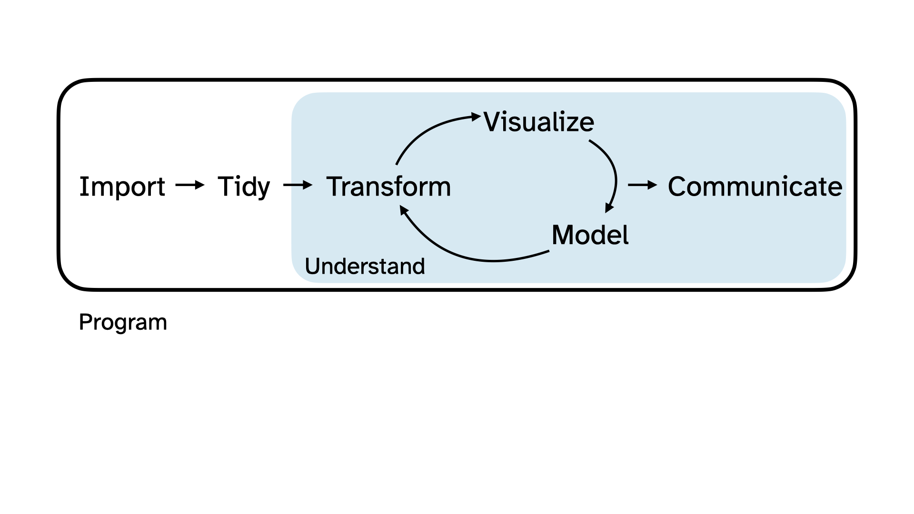
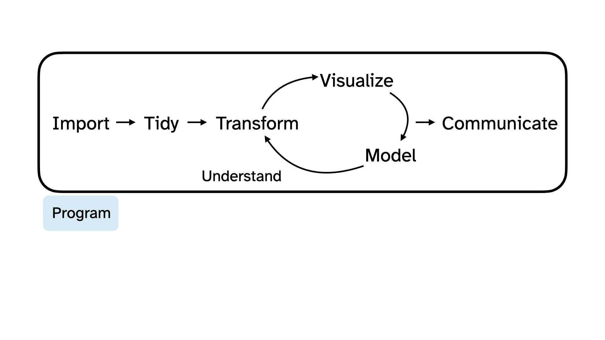

```{r}
#| label: setup
#| include: false
ggplot2::theme_set(ggplot2::theme_gray(base_size = 16))
```

# Hello world!

# Meet the professor

## Meet each other

::: question
Please tell us...

-   Your name
-   Your year
-   Your major
-   Anything else
:::


## Meet data science

::: incremental
-   **Data science** is an exciting discipline that allows you to turn raw data into understanding, insight, and knowledge.


-   This is a course on introduction to data science, with an emphasis on **statistical thinking**.
:::

## Application exercise

::: appex
Or more like demo for today...

 [rcnj-ids-fa26.github.io/ae/ae-00-unvotes.html](https://rcnj-ids-fa26.github.io/ae/ae-00-unvotes.html)
:::

# Data science life cycle

## Data science life cycle

{fig-alt="Data science life cycle"}


## Import

{fig-alt="Data science life cycle, with import highlighted"}

## Tidy + transform

{fig-alt="Data science life cycle, with tidy and transform highlighted"}

## Visualize

{fig-alt="Data science life cycle, with visualize highlighted"}

## Model

{fig-alt="Data science life cycle, with model highlighted"}

## Understand

{fig-alt="Data science life cycle, with understand highlighted"}

## Communicate

{fig-alt="Data science life cycle, with communicate highlighted"}

## Understand + communicate

{fig-alt="Data science life cycle, with understand and communicate highlighted"}

## Program

{fig-alt="Data science life cycle, with program highlighted"}

# Course overview

## Canvas

-   All course materials
-   Links to Posit Cloud, GitHub, Gradescope, etc.

## Course toolkit

-   Posit Cloud: [posit.cloud](https://posit.cloud)
-   GitHub organization: [github.com/rcnj-ids-fa26](https://github.com/rcnj-ids-fa26)
-   Assignment submission and feedback: Gradescope

## Activities {.smaller}

-   Introduce new content and prepare for lectures by completing the readings and reading quizzes
-   Attend and actively participate in class, office hours, team meetings
-   Practice applying statistical concepts and computing with Application Exercises during lecture
-   Put together what you've learned to analyze real-world data
    -   Lab assignments (~6 throughout semester)
    -   Exams (2 during semester)
    -   Final project completed in teams
    
## Reading Quizzes {.smaller}
- Covers the assigned reading
- Due **before class** Mondays and Thursdays at 11am
- Complete asynchronously in Canvas (open book, open notes)
- Two attempts


## Application exercises {.smaller}

-   Daily-ish in lecture

-   Hands-on coding activities

## Labs {.smaller}

-   Occasionally started in class

-   Mostly done as homework

-   Discussion with classmates ok, copying not ok!

-   Lowest score dropped

## Exams {.smaller}

Two in-class exams:

-   Oct. 15

-   Dec. 3


## Project {.smaller}

-   Dataset of your choice, methods of your choice

-   Teamwork

-   Several milestones / interim deadlines throughout semester

-   Final milestone: Presentation and write-up during our Final Exam slot

-   Peer review between teams for content, peer evaluation within teams for contribution

-   Some class time allocated to project work


## Grading {.smaller}

| Category              | Percentage |
|-----------------------|------------|
| Reading Quizzes       | 10%        |
| Labs                  | 20%        |
| Exam 1               | 25%        |
| Exam 2                 | 25%        |
| Project               | 20%        |


See course syllabus for how the final letter grade will be determined.


## Use of AI tools

-    **AI tools for code:** Not allowed!

-    **AI tools for narrative:** Not allowed!

-    **AI tools for learning:** Sure, but be careful/critical!


## This week's tasks

-   Complete Lab 0
    -   Computational setup
    -   Getting to know you survey
-   Read the syllabus
-   Readings and Reading Quizzes for next class (due Monday at 11am):
    - "8/27 Hello, World!" module
    - "8/31 Meet the toolkit" module

