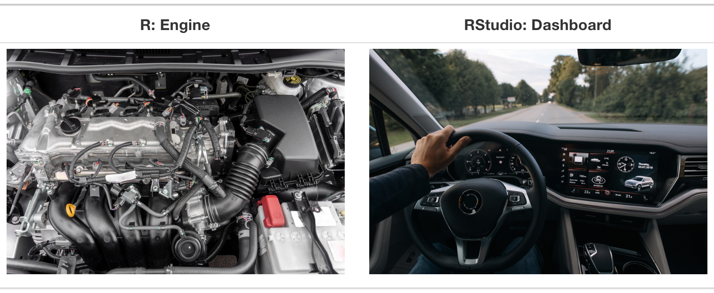
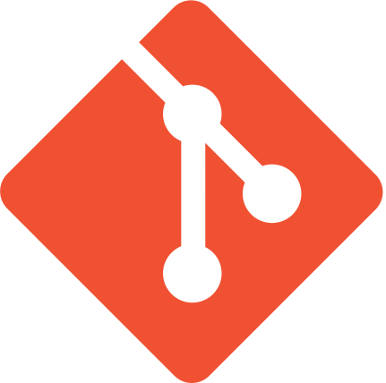
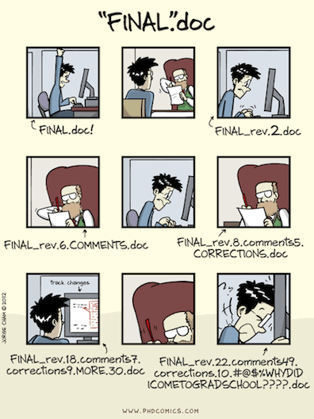
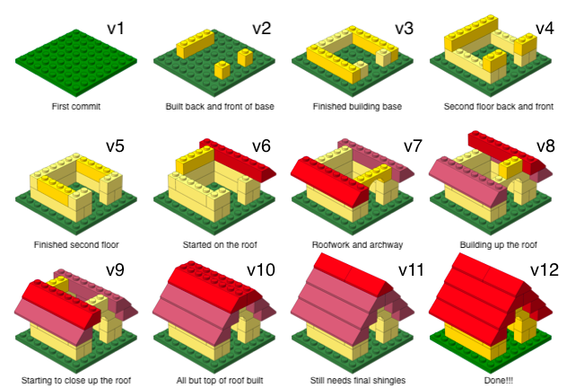
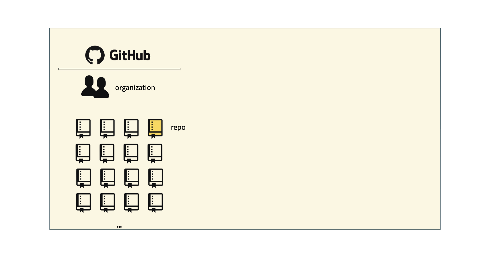
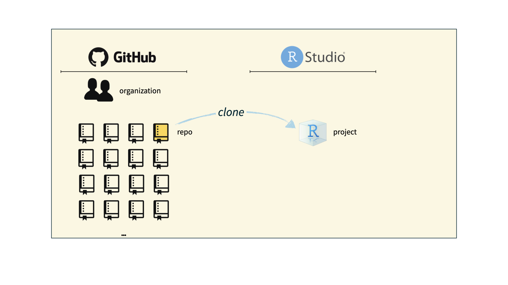
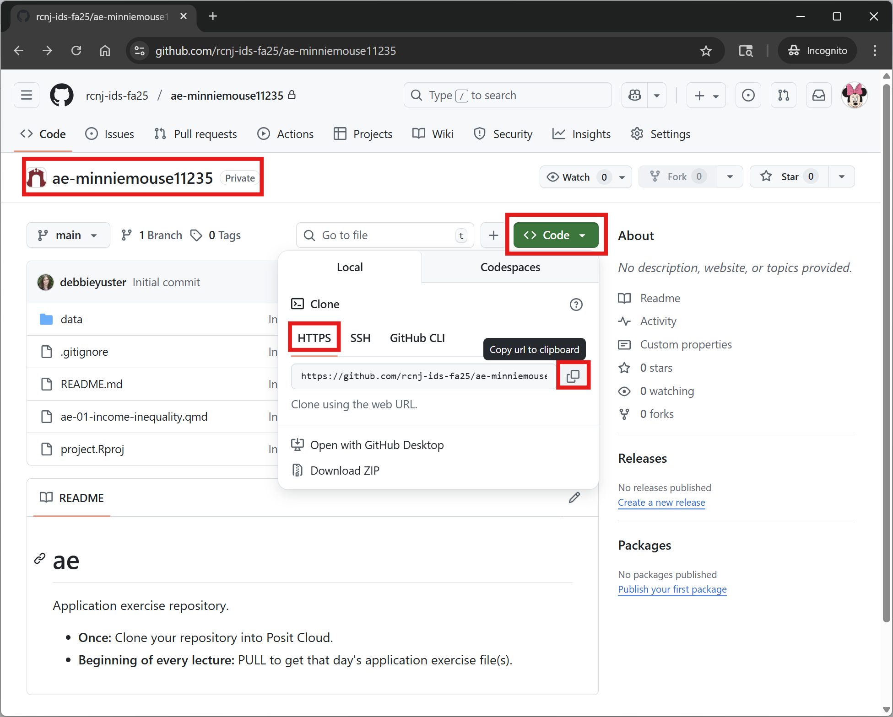
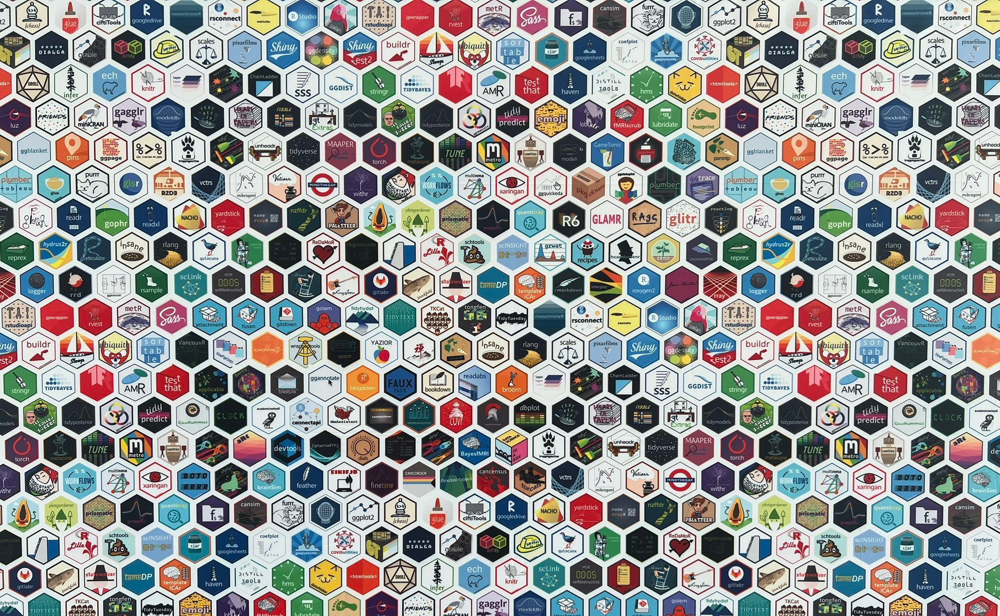

```{r}
#| label: setup
#| include: false
ggplot2::theme_set(ggplot2::theme_gray(base_size = 16))
```

## Computational toolkit {.smaller}

> By the end of the course, you will be able to gain insight from data, reproducibly (with literate programming and version control) and collaboratively, using modern programming tools and techniques.

-   Computing:
    -   Language: R
    -   IDE: RStudio
    -   Packages: tidyverse (primarily), plus others
    -   Authoring: Quarto
-   Version control:
    -   Tracking: Git
    -   Hosting and collaboration: GitHub

## What does it mean for a data analysis to be "reproducible"?

. . .

**Short-term goals:**

-   Are the tables and figures reproducible from the code and data?
-   Does the code actually do what you think it does?
-   In addition to what was done, is it clear *why* it was done?

. . .

**Long-term goals:**

-   Can the code be used for other data?
-   Can you extend the code to do other things?

## Toolkit for reproducibility

::: incremental

-   Scriptability -- Coding as opposed to using a point-and-click tool $\rightarrow$ R
-   Literate programming -- Code, narrative, output in one place, as opposed to copying and pasting code output into a document (e.g., Word or Google Doc) that contains the narrative $\rightarrow$ Quarto
-   Version control -- Track changes with brief messages that describe those changes $\rightarrow$ Git / GitHub

:::

# Writing code: R and RStudio

## R and RStudio {.smaller}

::::: columns

::: {.column width="50%"}

{fig-alt="R logo" fig-align="center"}

-   R is an open-source statistical **programming language**
-   R is also an environment for statistical computing and graphics
-   It's easily extensible with *packages*

:::

::: {.column .fragment width="50%"}

{fig-alt="RStudio logo"}

-   RStudio is a convenient interface for R called an **IDE** (integrated development environment), e.g. *"I write R code in the RStudio IDE"*
-   RStudio is not a requirement for programming with R, but it's very commonly used by R programmers and data scientists

:::

:::::

## R vs. RStudio

[{fig-alt="On the left: a car engine. On the right: a car dashboard. The engine is labelled R. The dashboard is labelled RStudio." fig-align="center" width="1001"}](https://moderndive.com/1-getting-started.html)

::: aside

Source: [Modern Dive](https://moderndive.com/1-getting-started.html).

:::

## R packages {.smaller}

::: incremental

-   **Packages**: Fundamental units of reproducible R code, including reusable R functions, the documentation that describes how to use them, and sample data<sup>1</sup>

-   As of 8/25/26, there are 24,780 R packages available on **CRAN** (the Comprehensive R Archive Network)<sup>2</sup>

-   We're going to work with a small (but important) subset of these!

:::

::: aside

<sup>1</sup> Wickham and Bryan, [R Packages](https://r-pkgs.org/).

<sup>2</sup> [CRAN contributed packages](https://cran.r-project.org/web/packages/).

:::

## Tour: R + RStudio {.smaller}

::::::: columns

:::: {.column width="50%"}

::: demo

**Option 1:**

Sit back and enjoy the show!

:::

::::

:::: {.column width="50%"}

::: appex

**Option 2:**

Go to our course workspace ([Posit Cloud](https://posit.cloud) > data-101-fall-2026) and open **lab-0** (your project from last time).


:::

::::

:::::::

## Tour recap: R + RStudio


# A short list<br>(for now)<br>of R essentials

## Packages {.smaller}

-   Installed with `install.packages()`, once per system:

```{r}
#| eval: false
install.packages("palmerpenguins")
```

::: callout-note

We already pre-installed many of the package you'll need for this course, so you might go the whole semester without needing to run `install.packages()`!

:::

. . .

-   Loaded with `library()`, once per session:

```{r}
#| label: load-palmerpenguins
library(palmerpenguins)
```

## Packages, an analogy

If data analysis was cooking...

::: incremental

-   Installing a package would be like buying ingredients from the store

-   Loading a package would be like getting the ingredients out of your pantry and setting them on your counter top to be used

:::

## tidyverse

::: hand

aka the package you'll hear about the most...

:::

::: columns

::: {.column width="40%"}

[{fig-alt="Hex logos for dplyr, ggplot2, forcats, tibble, readr, stringr, tidyr, and purrr"}](https://tidyverse.org)

:::

::: {.column .fragment width="60%"}

[tidyverse.org](https://www.tidyverse.org/)

-   The **tidyverse** is an opinionated collection of R packages designed for data science
-   All packages share an underlying philosophy and a common grammar

:::

:::

## Data frames and variables

-   Each row of a data frame is an **observation**

. . .

-   Each column of a data frame is a **variable**

. . .

-   Columns (variables) in data frames can be accessed with `$`:

```{r}
#| eval: false
dataframe$variable_name
```

## `penguins` data frame {.smaller}

```{r}
penguins
```

## `bill_length_mm`  {.smaller}

```{r}
penguins$bill_length_mm
```

## Participate {.smaller}


::: task

Why did the error occur?

:::

```{r}
#| label: flipper-length-mm
#| error: true
flipper_length_mm
```


## `flipper_length_mm` {.smaller}

This can be fixed by using `penguins$flipper_length_mm`.

```{r}
penguins$flipper_length_mm
```

## `function(argument)`

Functions are (most often) verbs, followed by what they will be applied to in parentheses:

```{r}
#| eval: false
do_this(to_this)
do_that(to_this, to_that, with_those)
```

## Example function: `mean()`

```{r}
x <- c(1, 2, 3, 4, 5, 6, 7, 8, 9, NA)
x
```

```{r}
mean(x)
```

```{r}
mean(x, na.rm = TRUE)
```

## Help

Object documentation can be accessed with `?`

::: columns

::: {.column width="50%"}

```{r}
#| eval: false
?mean
```

:::

::: {.column width="50%"}

{fig-alt="Documentation for mean function in R."}

:::

:::

# Toolkit: Version control and collaboration

## Git and GitHub {.smaller}

::: columns

::: {.column .fragment width="50%"}

{fig-alt="Git logo" fig-align="center" width="150"}

-   Git is a version control system -- like "Track Changes" features from Microsoft Word, on steroids
-   It's not the only version control system, but it's a very popular one

:::

::: {.column .fragment width="50%"}

{fig-alt="GitHub logo" fig-align="center" width="150"}

-   GitHub is the home for your Git-based projects on the internet -- like Dropbox but much, much better

-   We will use GitHub as a platform for web hosting and collaboration (and as our course management system!)

:::

:::

## Versioning - done badly

{fig-align="center"}

## Versioning - done better

{fig-align="center"}

## Versioning - done even better

::: hand

with human readable messages

:::

{fig-align="center"}

## How will we use Git and GitHub?

{fig-align="center"}

## How will we use Git and GitHub?

{fig-align="center"}

## How will we use Git and GitHub?

{fig-align="center"}

## How will we use Git and GitHub?

{fig-align="center"}

## Git and GitHub tips {.smaller}

::: incremental

-   There are millions of git commands -- ok, that's an exaggeration, but there are a lot of them -- and very few people know them all. 99% of the time you will use git to add, commit, push, and pull.
-   We will be doing Git things and interfacing with GitHub through RStudio, but if you google for help you might come across methods for doing these things in the command line -- skip that and move on to the next resource unless you feel comfortable trying it out.
-   There is a great resource for working with git and R: [happygitwithr.com](http://happygitwithr.com/). Some of the content in there is beyond the scope of this course, but it's a good place to look for help.

:::

## Tour: Git + GitHub {.smaller .scrollable}

::: columns

::: {.column width="50%"}

::: demo

**Option 1:**

Sit back and enjoy the show!

:::

::: callout-note

You'll need to stick to this option if you haven't yet accepted your GitHub invite and don't have a repo created for you.

:::

:::

::: {.column width="50%"}

::: appex

**Option 2:**

Go to the [course GitHub organization](https://github.com/rcnj-ids-fa26) and clone `ae-YOUR-GITHUB-NAME` repo to [Posit Cloud](https://posit.cloud) in our course workspace.

:::

:::

:::

<br>

<details>
<summary>Tour recap: Git + GitHub</summary>

-   Find your assignment repo, that will always be named using the naming convention `assignment_title-YOUR-GITHUB-NAME`, e.g., `ae-minniemouse11235` or `lab-1-minniemouse11235`.

-   Click on the green "Code" button, make sure HTTPS is selected, copy the repo URL

{fig-align="center" width="600"}

- In Posit Cloud (course workspace), click New Project ➛ New Project from Git Repository ➛ Git.

- Paste the URL of your assignment repo into the dialog box URL of your Git Repository.

- Click OK.

</details>


# Quarto

## Quarto

::: incremental

-   Fully reproducible reports -- each time you render the analysis is ran from the beginning
-   Code goes in cells narrative goes outside of cells
-   Optional: A visual editor for a familiar / Google docs-like editing experience

:::

## Tour: Quarto (and more Git + GitHub) {.smaller .scrollable}

::: columns

::: {.column width="50%"}

::: demo

**Option 1:**

Sit back and enjoy the show!

:::

::: callout-note

If you chose (or had to choose) this option for the previous tour, or if you couldn't clone your repo for any reason, you'll need to stick to this option.

:::

:::

::: {.column width="50%"}

::: appex
**Option 2:**

Go to RStudio and open the document `ae-01-income-inequality.qmd`.

:::

:::

:::

<br>

<details>
<summary>Tour recap: Quarto</summary>

{fig-alt="RStudio IDE with a Quarto document, source code on the left and output on the right. Annotated to show the YAML, a link, a header, and a code cell." fig-align="center"}

</details>

<br>

<details>
<summary>Tour recap: Git + GitHub</summary>

Once we made changes to our Quarto document, we

- went to the Git pane in RStudio

- staged our changes by clicking the checkboxes next to the relevant files

- committed our changes with an informative commit message

- pushed our changes to our application exercise repos

- confirmed on GitHub that we could see our changes pushed from RStudio

</details>

## How will we use Quarto?

-   Every application exercise, lab, project, etc. is an Quarto document
-   You'll always have a template Quarto document to start with
-   The amount of scaffolding in the template will decrease over the semester

## What's with all the hexes?

{fig-alt="Hex logos for many packages" fig-align="center"}

