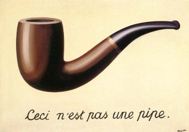
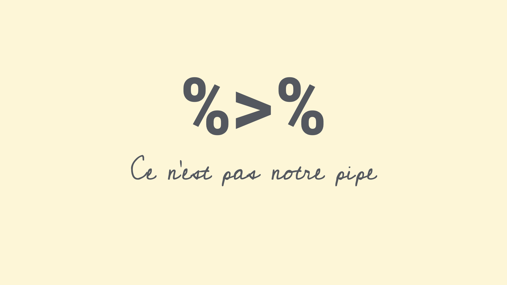
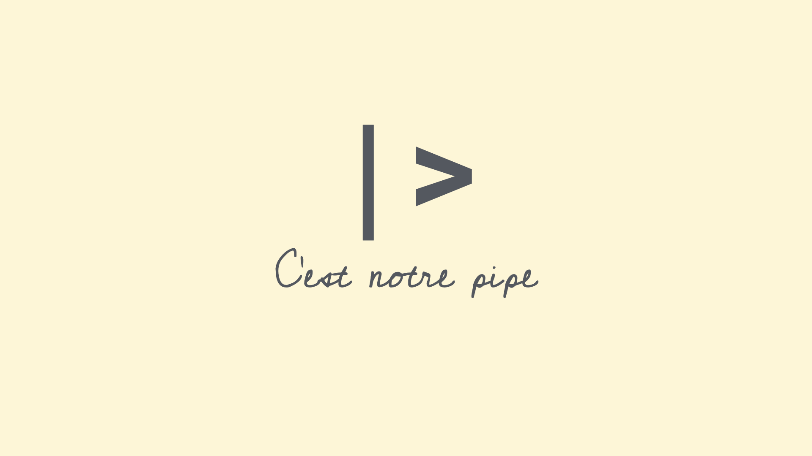

```{r}
#| label: setup
#| include: false
ggplot2::theme_set(ggplot2::theme_gray(base_size = 16))
```

# Warm-up

## Survey

Q1. Fill in the blank:

On Mondays, I have `_____` class(es), including DATA 101.

Q2. Which of the following best describes you?

A) First-year
B) Sophomore
C) Junior
D) Senior

## Recap: The tidyverse package {.smaller}

When you load the **tidyverse** package, you get access to a suite of packages that work well together for data manipulation and visualization:

```{r}
library(tidyverse)
```

You never need to load one of these packages individually after you load the tidyverse, e.g.,

```{r}
library(dplyr) # not necessary if you already loaded tidyverse in your document/session
```

## Recap: Loading packages {.smaller}

- You only need to load a package once per R session or Quarto document.
- It's good practice to load all the packages you need at the start of your document, that's why the templates I give you usually has a `load-packages` code cell at the top.

```{r}
#| echo: fenced
#| label: load-packages
#| message: false
library(tidyverse)
library(ggthemes)
library(scales)
# etc.
```

- You never need to load these packages again further down in the same document.
- If you need a new package further down in the document, go back and add it to the `load-packages` code cell.

## Recap: Pipes

::: center-align

{width=900px}

This is not a pipe.

:::

## Recap: Pipes

::: center-align

{width=900px}

This is not our pipe [operator].

:::

## Recap: Pipes

::: center-align

{width=900px}

**This is our pipe [operator].**

:::

# Data types

## Data types in R

-   **character**[: `"First-year"` -- Character strings]{.fragment}
-   **double**[: `2.5` -- Floating point numerical values (default numerical type)]{.fragment}
-   **integer**[: `3L` -- Integer numerical values (indicated with an `L`)]{.fragment}
-   **logical**[: `TRUE` or `FALSE` -- Boolean values]{.fragment}
-   and some more, but we won't be focusing on those

## Vectors {.smaller}

Vectors can be constructed using the `c()` function.

-   Numeric vector:

```{r}
c(1, 2, 3)
```

. . .

-   Character vector:

```{r}
c("Hello", "World!")
```

. . .

-   Vector made of vectors:

```{r}
c(c("hi", "hello"), c("bye", "jello"))
```

## Vectors and their types

::: question
Why do we care about vectors and their types, especially when all we've worked with so far are data frames and their columns... 
:::

::: fragment
Each column of a data frame is (generally) a vector, and the type of that vector determines what operations can be performed on it or how it will behave when certain functions are applied to it. For example, you can't take the mean of a character vector, but you can take the mean of a numeric vector.
:::


## Converting between types

::: hand
with intention...
:::

::::: columns
::: column

```{r}
x <- 1:3
x
typeof(x)
```

:::

::: {.column .fragment}

```{r}
y <- as.character(x)
y
typeof(y)
```

:::
:::::

## Converting between types

::: hand
with intention...
:::

::::: columns
::: column

```{r}
x <- c(TRUE, FALSE)
x
typeof(x)
```

:::

::: {.column .fragment}

```{r}
y <- as.numeric(x)
y
typeof(y)
```

:::
:::::

## Converting between types

::: hand
without intention...
:::


```{r}
c(2, "Just this one!")
```

. . .

R will happily convert between various types without complaint when different types of data are concatenated in a vector, and that's not always a great thing!

## Converting between types

::: hand
without intention...
:::

```{r}
c(FALSE, 3L)
```

. . .

```{r}
c(FALSE, 1.2)
```

. . .

```{r}
c(2L, "two")
```

. . .

```{r}
c(TRUE, "two")
```

## Participate

What is the output of `typeof(c(1.2, 3L))`?

A) `"character"`
B) `"double"`
C) `"integer"`
D) `"logical"`

## Explicit vs. implicit coercion

::::: columns
::: column
**Explicit coercion:**

When you call a function like `as.logical()`, `as.numeric()`, `as.integer()`, `as.double()`, or `as.character()`.
:::

::: {.column .fragment}
**Implicit coercion:**

Happens when you use a vector in a specific context that expects a certain type of vector.
:::
:::::

# Data classes

## Data classes {.smaller}

::: incremental
-   Vectors are like Lego building blocks
-   We stick them together to build more complicated constructs, e.g. *representations of data*
-   The **class** attribute of an object determines its behavior
-   Examples: factors, dates, and data frames
:::

## Factors {.smaller}

R uses factors to handle categorical variables, variables that have a fixed and known set of possible values

```{r}
class_years <- factor(
  c(
    "First-year",
    "Sophomore",
    "Sophomore",
    "Senior",
    "Junior"
  )
)
class_years
```

::::: columns
::: {.column .fragment}

```{r}
typeof(class_years)
```

:::

::: {.column .fragment}

```{r}
class(class_years)
```

:::
:::::

## More on factors

We can think of factors as a character (level labels) and an integer (level numbers) glued together

```{r}
glimpse(class_years)
```

```{r}
as.integer(class_years)
```

## Dates

```{r}
today <- as.Date("2026-10-05")
today
```

```{r}
typeof(today)
```

```{r}
class(today)
```

## More on dates

We can think of dates as an integer (the number of days since the origin, 1 Jan 1970) and an integer (the origin) glued together

```{r}
as.integer(today)
```

```{r}
as.integer(today) / 365 # roughly 56.8 yrs
```

## Data frames

We can think of data frames like vectors of equal length glued together

```{r}
df <- data.frame(x = 1:2, y = 3:4)
df
```

::::: columns
::: column
```{r}
typeof(df)
```

:::

::: column

```{r}
class(df)
```

:::
:::::

## Lists {.smaller}

Lists are a generic vector container; vectors of any type can go in them

```{r}
#| code-line-numbers: "|2|3|4"
l <- list(
  x = 1:4,
  y = c("hi", "hello", "jello"),
  z = c(TRUE, FALSE)
)
l
```

## Lists and data frames {.smaller}

-   A data frame is a special list containing vectors of equal length

```{r}
df
```

-   When we use the `pull()` function, we extract a vector from the data frame

```{r}
df |>
  pull(y)
```

# Working with factors

## Read data in as character strings
```{r}
#| include: false
library(tidyverse)
library(readxl)
survey <- read_excel(here::here("slides", "data/survey-2026-10-05.xlsx"))
```

```{r}
#| message: false
survey
```

## But coerce when plotting

```{r}
#| out-width: 100%
#| fig-width: 7
#| fig-asp: 0.5
survey |>
  ggplot(aes(x = year)) +
  geom_bar()
```

## Use forcats to reorder levels {.smaller}

```{r}
#| out-width: 100%
#| fig-width: 7
#| fig-asp: 0.5
survey <- survey |>
  mutate(
    year = fct_relevel(year, "First-year", "Sophomore", "Junior", "Senior")
  )

survey |>
  ggplot(mapping = aes(x = year)) +
  geom_bar()
```

## A peek into forcats {.smaller}

::: columns

::: {.column .fragment}

Reordering levels by:

-   `fct_relevel()`: hand

-   `fct_infreq()`: frequency

-   `fct_reorder()`: sorting along another variable

-   `fct_rev()`: reversing

...

:::

::: {.column  .fragment}

Changing level values by:

-   `fct_lump()`: lumping uncommon levels together into "other"

-   `fct_other()`: manually replacing some levels with "other"

...

:::

:::

::: aside
More functions from the **forcats** package can be found [here](https://forcats.tidyverse.org/reference/index.html).
:::


# Application exercise

## `ae-07-survey-types` {.smaller}

::: appex
-   Go to your ae project in Posit Cloud

-   If you haven't yet done so, make sure all of your changes up to this point are committed and pushed, i.e., there's nothing left in your source control pane.

-   If you haven't yet done so, pull to get today's application exercise file: `ae-07-survey-types.qmd`.

-   Work through the application exercise in class, and render, commit, and push your edits by the end of class.
:::
