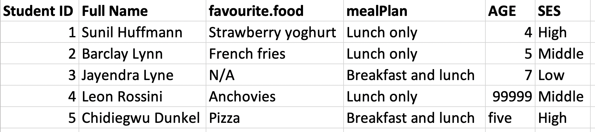
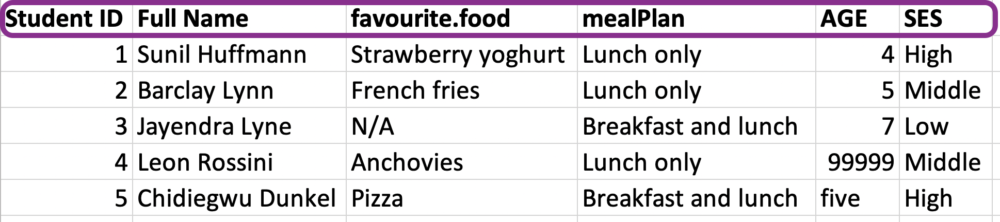
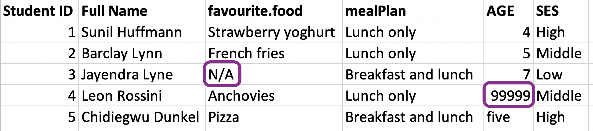
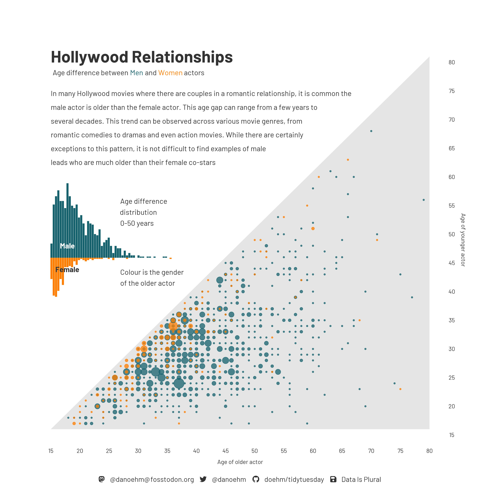

```{r}
#| label: setup
#| include: false
ggplot2::theme_set(ggplot2::theme_gray(base_size = 24))
todays_ae <- "ae-08-age-gaps-import"
library(tidyverse)
```

## Announcements - Exam 1

- Exam 1 next Thursday 10/15
- Administered through Canvas via [Respondus LockDown Browser](https://download.respondus.com/lockdown/download.php?id=931936966)
- HDS, IMS, and R4DS textbooks will be accessible
- Exam review questions are posted in Canvas (Exams module)
- Will have time for review on Monday

## Announcements - Final Project

We'll start working on the final project soon.

- Start thinking about your project teams:
  - Teams of ~3 people
  - Fill out the project team request form in Canvas by Wednesday night


# Reading data into R

## Reading rectangular data

-   Using the [**readr**](https://readr.tidyverse.org/) package:
    -   Most commonly: `read_csv()`
    -   Maybe also: `read_tsv()`, `read_delim()`, etc.

. . .

-   Using the [**readxl**](https://readxl.tidyverse.org/) package: `read_excel()`

. . .

-   Using the [**googlesheets4**](https://googlesheets4.tidyverse.org/) package: `read_sheet()` -- We won't cover this, but might be useful for your projects

## Example: Favorite foods



. . . 

```{r}
library(readxl)
fav_food <- read_excel("data/favourite-food.xlsx")
fav_food
```

---

## Column names (Option 1 - specify) {.smaller}

{fig-align="center" width="1000"}

. . .

```{r}
fav_food <- read_excel("data/favourite-food.xlsx",
  col_names = c("student_id", "name", "favourite_food", "meal_plan", "age", "ses"),
  skip = 1
)

fav_food
```

---

## Column names (Option 2 - janitor package) {.smaller}


```{r}
fav_food <- read_excel("data/favourite-food.xlsx")|>
  janitor::clean_names()

fav_food 
```

---

## Handling NAs {.smaller}



. . .

```{r}
fav_food <- read_excel("data/favourite-food.xlsx", na = c("N/A", "99999")) |>
  janitor::clean_names()

fav_food
```

---

## Make `age` numeric {.smaller}

:::: {.columns}
::: {.column width="70%"}

```{r}
fav_food <- fav_food |>
  mutate(
    age = if_else(age == "five", "5", age),
    age = as.numeric(age)
    )

glimpse(fav_food) 
```

:::

::: {.column width="30%"}

:::
::::

---

## Socio-economic status

::: {.callout-note title="Question"}
What order are the levels of `ses` listed in?
:::

:::: {.columns}
::: {.column width="70%"}

```{r}
fav_food |>
  count(ses)
```

:::

::: {.column width="30%"}

:::
::::

---

## Make `ses` a factor

```{r}
fav_food <- fav_food |>
  mutate(ses = fct_relevel(ses, "Low", "Middle", "High"))

fav_food |>
  count(ses)
```

---

## Putting it all together {.smaller}

```{r}
fav_food <- read_excel("data/favourite-food.xlsx", na = c("N/A", "99999")) |>
  janitor::clean_names() |>
  mutate(
    age = if_else(age == "five", "5", age), 
    age = as.numeric(age),
    ses = fct_relevel(ses, "Low", "Middle", "High")
  )

fav_food
```

---

## Out and back in

```{r}
write_csv(fav_food, file = "data/fav-food-clean.csv")

fav_food_clean <- read_csv("data/fav-food-clean.csv")
```

---

::: {.callout-note title="Question"}
What happened to `ses`?
:::

```{r}
fav_food_clean |>
  count(ses)
```

---

## `read_rds()` and `write_rds()`

* CSVs can be unreliable for saving interim results if there is specific variable type information you want to hold on to.
* An alternative is RDS files, you can read and write them with `read_rds()` and `write_rds()`, respectively.

```{r eval=FALSE}
read_rds(path)
write_rds(x, path)
```

---

## Out and back in, take 2

```{r}
write_rds(fav_food, file = "data/fav-food-clean.rds")

fav_food_clean <- read_rds("data/fav-food-clean.rds")

fav_food_clean |>
  count(ses)
```

# Application exercise

## Reading Excel files

-   Read an Excel file, with all its Excel-ness

-   Split it into subsets based on features of the data

-   Write out subsets as CSV files

---

## Age gap in Hollywood relationships {.smaller}

{fig-align="center" width="1000"}

## `{r} todays_ae` {.smaller}

::: appex
-   Go to your ae project in RStudio.

-   If you haven't yet done so, make sure all of your changes up to this point are committed and pushed, i.e., there's nothing left in your Git pane.

-   If you haven't yet done so, click Pull to get today's application exercise file: *`{r} paste0(todays_ae, ".qmd")`*.

-   Work through the application exercise in class, and render, commit, and push your edits.
:::

